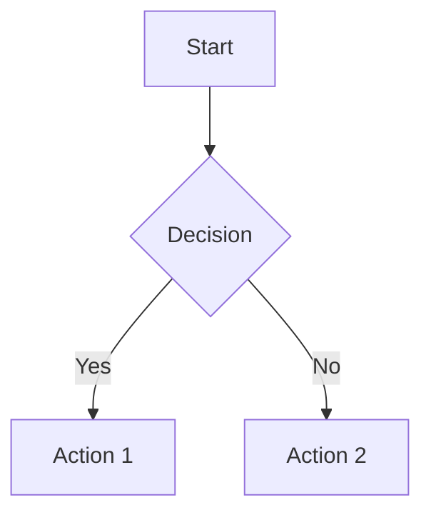

The handbook grows through contributions from everyone in our organization. Your input makes it better.

## Why Contribute?

- **Help Colleagues** - Make information easier to find
- **Share Knowledge** - Document what you know
- **Improve Onboarding** - Help new team members get up to speed faster
- **Build History** - Create a record of how we work

## How to Contribute

Our handbook is managed through Git, and the easiest way for most team members to contribute is by using the web-based editor in our repository.

### Editing a Page with the Web Editor

Here’s the step-by-step process for making a change:

1.  **Navigate to the Page**: Find the page you want to edit in the handbook.
2.  **Find the Source File**: Every page will have a link (usually at the bottom) that says "Edit this page" or similar. Clicking this will take you directly to the corresponding Markdown file in our repository.
3.  **Edit the File**: The repository will open the file in a web-based text editor. You can make your changes directly in the browser. You'll be using Markdown syntax.
4.  **Propose Changes**: Once you're done, look for a button to "Propose changes" or "Commit changes". This will save your edits to a new branch.
5.  **Create a Pull Request**: Follow the prompts to create a "Pull Request" (also known as a Merge Request). This is how you submit your changes for review. Give your pull request a clear title and a brief description of what you changed and why.
6.  **Review and Merge**: A maintainer will review your changes. They might suggest some edits or ask questions. Once it's approved, they will merge your contribution, and the site will be updated automatically.

### For Smaller Changes (Typos, Broken Links)

Even small fixes are valuable! Don't hesitate to create a pull request for a single typo. It helps keep the handbook accurate and professional.

## Content Guidelines

### Writing Style

- **Clear and Concise** - Get to the point
- **Friendly but Professional** - Write like you're helping a colleague
- **Use Examples** - Show, don't just tell
- **Link When Helpful** - Connect related concepts

### Formatting

- Use markdown for formatting
- Follow existing patterns in the section
- Use headers to organize information
- Add links to related topics

### Images and Media

- Optimize images for web
- Include alt text for accessibility
- Use the assets folder for images
- Keep file sizes reasonable

### Visual Diagrams with Mermaid

The handbook supports Mermaid diagrams for visual representations. You can create flowcharts, sequence diagrams, and more using simple text syntax:

````markdown

````

**💡 Pro Tip**: If you're not familiar with Mermaid syntax, you can describe what you want to ChatGPT or another AI assistant and ask it to generate the Mermaid.js code for you. Just paste the generated code into your Markdown file inside a fenced code block with the `mermaid` language tag!

## Review Process

1. Submit your change
2. Automated checks run
3. Peer or maintainer reviews
4. Changes are merged
5. New version is published

## Getting Help

- Check the [Handbook Usage](/about-handbook/usage) guide
- Review the [Starlight documentation](https://starlight.astro.build/)
- Ask in team channels
- Contact the handbook maintainer

## What to Contribute

- **Corrections** - Fix errors and outdated information
- **Clarifications** - Make unclear explanations clearer
- **Examples** - Add real-world examples
- **New Sections** - Document new processes or teams
- **Improvements** - Better organization, formatting, or flow

Remember: It's better to make a small contribution than none at all. Every improvement matters.
