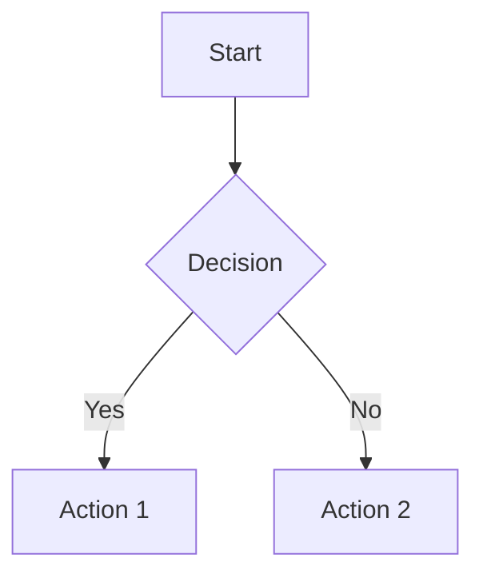

The handbook is organized to help you quickly find the information you need. It's built on a **Git-Ops model**, meaning the entire handbook is managed like a software project in a Git repository. This approach is inspired by industry leaders like [GitLab](https://handbook.gitlab.com/), who have pioneered transparent, collaborative documentation at scale.

## How This Site is Built

This handbook is not a typical document—it's a static website generated from a collection of Markdown files. Here's how it works:

1.  **Content is in Markdown**: Every page in this handbook is a `.mdx` file located in the `src/content/docs/` directory of our repository.
2.  **Astro Builds the Site**: We use a static site generator called [Astro](https://astro.build) with the [Starlight](https://starlight.astro.build/) theme to convert these Markdown files into the web pages you see.
3.  **Changes are Merged**: When you contribute an edit, you're changing one of these source files. Once your change is approved and merged, the site automatically rebuilds and publishes the new version.

This process ensures that our documentation is always up-to-date, version-controlled, and open to collaboration.

## Navigation

The handbook uses a simple structure:

- **Engineering** - Technical documentation, workflows, and engineering practices
- **About the Handbook** - This section, covering handbook philosophy and contribution

## Finding Information

### Using the Sidebar

The sidebar on the left provides quick navigation to all sections. Click any section to expand and see its pages.

### Using Search

Use the search functionality (Command/Ctrl + K) to quickly find specific information across the entire handbook.

### Internal Links

All internal links use relative paths. This ensures information remains connected even as we reorganize content.

### Visual Diagrams

The handbook supports [Mermaid](https://mermaid.js.org/) diagrams for flowcharts, sequence diagrams, and other visual representations. Use fenced code blocks with the `mermaid` language to create diagrams:

````markdown

````

## Keeping Up to Date

The handbook is updated regularly. Check the [Handbook Changelog](/about-handbook/changelog) to see recent changes.

## Best Practices

1. **Start with the Overview** - Each section has an index page that provides an overview
2. **Follow Links** - Internal links help you discover related information
3. **Check the Date** - Some information may have timestamps or "last updated" dates
4. **Ask for Updates** - If you find outdated information, contribute an update (see [Contribution Guide](/about-handbook/contribution))

## Organization Philosophy

Inspired by [GitLab's handbook model](https://handbook.gitlab.com/), we organize content to:

- Make it easy to find what you're looking for
- Encourage discovery of related information
- Support quick onboarding for new team members
- Maintain a historical record of our evolution
